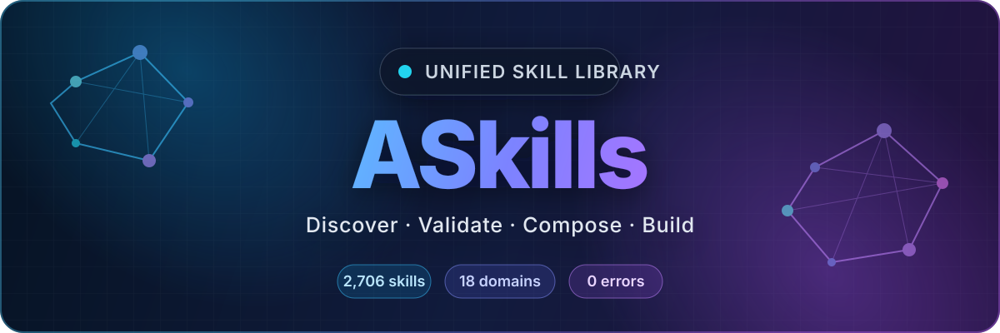
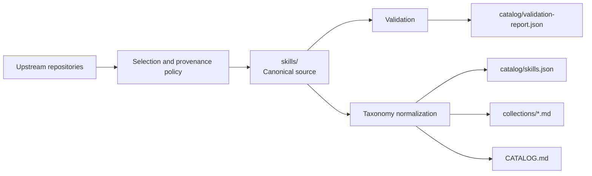

<div align="center">



### One library. 2,706 skills. 18 work domains.

**A source-attributed, validation-ready collection of reusable agent skills for AI, software, security, data, business, design, documents, research, automation, and more.**

[Tiếng Việt](README.vi.md) · [Browse Skills](CATALOG.md) · [Collections](collections/README.md) · [JSON Catalog](catalog/skills.json) · [Contributing](docs/contributing.md)

<br />


[](https://github.com/nguyen-thanh-1/ASkills/stargazers)
[](https://github.com/nguyen-thanh-1/ASkills/commits/main)
[](spec/agent-skills-spec.md)
[](THIRD_PARTY_NOTICES.md)

</div>

---

## Why ASkills?

Most skill collections become difficult to search, duplicate the same capability,
or lose track of where instructions came from. ASkills keeps the breadth while
adding a maintainable structure.

| | What you get |
|---|---|
| **One canonical tree** | Every installable skill has one canonical location under `skills/`. |
| **Clear discovery** | Eighteen generated collections organize the library without copying skill files. |
| **Traceable sources** | Source, source repository, license, and risk information are retained when available. |
| **Automated validation** | Frontmatter, IDs, duplicate names, taxonomy, and local references are checked deterministically. |
| **Machine-readable** | A complete JSON registry supports search, tooling, installers, and custom interfaces. |
| **Multiplatform foundation** | Skills follow the Agent Skills folder model and can be adapted to compatible coding agents. |

## Quick start

### Clone the complete library

```bash
git clone https://github.com/nguyen-thanh-1/ASkills.git
cd ASkills
```

### Find a skill

Browse [the full catalog](CATALOG.md), choose a
[work-domain collection](collections/README.md), or search locally:

```bash
# Search by skill ID or description
python -c "import json; d=json.load(open('catalog/skills.json', encoding='utf-8')); print('\n'.join(f\"{x['id']}: {x['description']}\" for x in d if 'docker' in (x['id']+' '+x['description']).lower()))"
```

### Install a selected skill

Copy only the chosen skill directory into the skills directory supported by your
agent. For Codex on Windows, for example:

```powershell
$skill = "systematic-debugging"
Copy-Item -Recurse ".\skills\$skill" "$env:USERPROFILE\.codex\skills\$skill"
```

Review the skill's `SKILL.md`, scripts, dependencies, and risk label before using
it. Installation paths and supported metadata can differ between agents.

### Validate the repository

```bash
python -m pip install -r requirements.txt
python tools/repo_skills.py all
```

Or use the npm shortcut:

```bash
npm run check
```

## Explore 18 work domains

| Build & Engineering | Business & Creative | Knowledge & Operations |
|---|---|---|
| [AI, ML & Agents](collections/ai-agents.md) | [Business, Finance & Legal](collections/business-finance-legal.md) | [Documents & Office](collections/documents-office.md) |
| [Software Development](collections/software-development.md) | [Marketing, Sales & SEO](collections/marketing-sales.md) | [Productivity & Collaboration](collections/productivity-collaboration.md) |
| [Cloud, DevOps & Reliability](collections/cloud-devops.md) | [Content, Writing & Media](collections/content-media.md) | [Research, Education & Science](collections/research-education.md) |
| [Data, Databases & Analytics](collections/data-analytics.md) | [Design & Creative](collections/design-creative.md) | [Product & Project Operations](collections/product-operations.md) |
| [Security & Compliance](collections/security.md) | [Games & Interactive](collections/games-interactive.md) | [Meta Skills & Personas](collections/meta-personas.md) |
| [Automation & Integrations](collections/automation-integrations.md) | [Blockchain & Web3](collections/blockchain.md) | [Other / Awaiting Classification](collections/other.md) |

## How the repository works



```text
skills/                 Canonical installable skill trees
collections/            Generated indexes for 18 work domains
catalog/                JSON registry, summary, and validation report
config/                 Taxonomy and official-import policy
docs/                   Architecture, contribution, and security guidance
spec/                   Agent Skills format reference
templates/              Maintained starter template
tools/repo_skills.py    Catalog builder and repository validator
sources/                Local upstream snapshots, excluded from Git
```

Read [the architecture guide](docs/architecture.md) for the design decisions.

## Quality and safety

The current catalog passes structural validation with **zero errors**. Remaining
editorial warnings are kept visible in
[`catalog/validation-report.json`](catalog/validation-report.json) instead of being
hidden by generic generated text.

Risk labels describe expected side effects, not trust:

| Risk | Meaning |
|---|---|
| `none` | Text or reasoning only. |
| `safe` | Read-only inspection or low-risk local commands. |
| `critical` | May modify state, use credentials, spend money, deploy, or call external systems. |
| `offensive` | Authorized security testing only. |
| `unknown` | Legacy content still awaiting semantic classification. |

Catalog inclusion is not a security certification. Read the complete skill and any
script that would execute. See [the security model](docs/security.md).

## Source policy

ASkills combines material from:

- [Anthropic Skills](https://github.com/anthropics/skills)
- [OpenAI Skills](https://github.com/openai/skills)
- [Agentic Awesome Skills](https://github.com/sickn33/agentic-awesome-skills)
- many upstream projects credited by individual skill metadata

When IDs collide, the repository keeps one default implementation and preserves
materially different workflows under a specific ID, such as
`skill-creator-anthropic` and `pdf-layout-review`. The selection rules live in
[`sources/manifest.yaml`](sources/manifest.yaml) and
[`config/official-imports.yaml`](config/official-imports.yaml).

## Contributing

Start with [the skill template](templates/SKILL.md), follow the
[curation guide](docs/contributing.md), and run:

```bash
npm run check
```

Contributions should add non-obvious expertise, declare truthful provenance and
risk, preserve license notices, and avoid duplicating an existing capability.

## Licensing

There is no single license that overrides the included skills. Each skill keeps
its own license file or upstream terms where available. Review
[THIRD_PARTY_NOTICES.md](THIRD_PARTY_NOTICES.md) before redistribution.

---

<div align="center">

**If ASkills helps your work, consider starring the repository.**

[Browse all skills](CATALOG.md) · [Read in Vietnamese](README.vi.md) · [Report an issue](https://github.com/nguyen-thanh-1/ASkills/issues)

</div>
